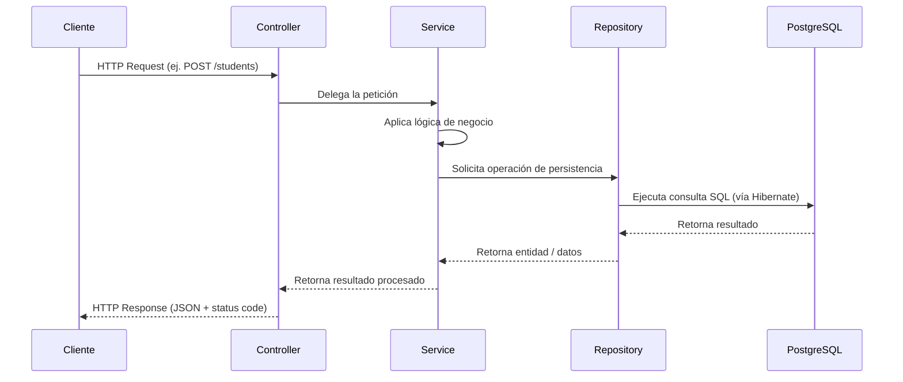
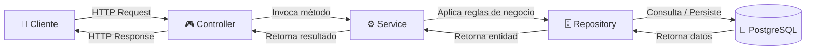

<div align="center">

# 🎓 Student Management Service

### API REST profesional para la gestión de estudiantes y calificaciones

*Construida con Java 26, Spring Boot 3 y PostgreSQL, siguiendo una arquitectura limpia por capas*

<br/>


<br/>

[📖 Descripción](#-descripción-del-proyecto) •
[🛠️ Tecnologías](#️-tecnologías-utilizadas) •
[🏗️ Arquitectura](#️-arquitectura) •
[🚀 Instalación](#-cómo-ejecutar-el-proyecto) •
[📡 Endpoints](#-endpoints) •
[🤝 Contribuir](#-mejoras-futuras)

</div>

<br/>

---

## 📖 Descripción del proyecto

**Student Management Service** es una API REST desarrollada con **Java 17** y **Spring Boot 3**, diseñada para administrar de forma eficiente estudiantes y sus calificaciones académicas.

El proyecto implementa un **CRUD completo** sobre las entidades `Student` y `Grade`, aplicando buenas prácticas de desarrollo backend como la separación por capas (Controller → Service → Repository), persistencia de datos mediante **Spring Data JPA** e **Hibernate**, y almacenamiento en una base de datos relacional **PostgreSQL**.

Toda la aplicación se encuentra **contenerizada con Docker y Docker Compose**, lo que permite levantar tanto la API como la base de datos con un único comando, garantizando un entorno de desarrollo y despliegue reproducible, portable y consistente.

Este proyecto está pensado como una base sólida y escalable para sistemas de gestión académica, sirviendo también como ejemplo de arquitectura backend moderna en el ecosistema Java/Spring.

> 💡 **Objetivo del proyecto:** ofrecer una API robusta, mantenible y fácil de extender, aplicando principios de diseño limpio y buenas prácticas del ecosistema Spring.

<br/>

## 🛠️ Tecnologías utilizadas

<div align="center">

| Tecnología | Versión / Detalle | Propósito |
|---|---|---|
| ☕ **Java** | 17 (LTS) | Lenguaje principal del proyecto |
| 🍃 **Spring Boot** | 3.x | Framework base para la construcción de la API |
| 🌐 **Spring Web** | - | Creación de endpoints REST |
| 🗄️ **Spring Data JPA** | - | Abstracción para el acceso a datos |
| 🧩 **Hibernate** | - | Implementación de JPA / ORM |
| 🐘 **PostgreSQL** | 15+ | Motor de base de datos relacional |
| 🐳 **Docker** | - | Contenerización de la aplicación |
| 🧱 **Docker Compose** | - | Orquestación de contenedores (API + DB) |
| 📦 **Maven** | - | Gestión de dependencias y build |
| ✍️ **Lombok** | - | Reducción de código boilerplate |
| 📮 **Postman** | - | Pruebas y documentación de endpoints |

</div>

<br/>

## 🏗️ Arquitectura

El proyecto sigue una **arquitectura en capas (Layered Architecture)**, un patrón ampliamente utilizado en aplicaciones Spring Boot que favorece la separación de responsabilidades, la mantenibilidad y la escalabilidad del código.

```
┌──────────────────────────────────────────────┐
│                   CLIENTE                     │
│         (Postman / Frontend / Cliente HTTP)   │
└───────────────────────┬────────────────────────┘
                         │  HTTP Request (JSON)
                         ▼
┌──────────────────────────────────────────────┐
│                 CONTROLLER                    │
│   Recibe las peticiones HTTP y las delega     │
│   a la capa de servicio (@RestController)     │
└───────────────────────┬────────────────────────┘
                         ▼
┌──────────────────────────────────────────────┐
│                   SERVICE                     │
│   Contiene la lógica de negocio               │
│   Orquesta operaciones entre capas            │
└───────────────────────┬────────────────────────┘
                         ▼
┌──────────────────────────────────────────────┐
│                 REPOSITORY                    │
│   Interfaz que extiende JpaRepository         │
│   Ejecuta operaciones CRUD sobre la BD        │
└───────────────────────┬────────────────────────┘
                         ▼
┌──────────────────────────────────────────────┐
│                 POSTGRESQL                    │
│         Base de datos relacional              │
└──────────────────────────────────────────────┘
```

Esta separación permite:

- ✅ **Bajo acoplamiento** entre las distintas responsabilidades de la aplicación.
- ✅ **Alta cohesión** dentro de cada capa.
- ✅ **Facilidad de testeo**, al poder aislar cada componente.
- ✅ **Escalabilidad**, permitiendo agregar nuevas funcionalidades sin romper la estructura existente.

<br/>

## 🗃️ Modelo de Base de Datos

El sistema está compuesto por dos entidades principales, `Student` y `Grade`, relacionadas mediante una relación **One-to-Many / Many-to-One**.

```
┌───────────────────────────┐          ┌───────────────────────────┐
│          STUDENT           │          │           GRADE            │
├───────────────────────────┤          ├───────────────────────────┤
│ PK  id            : Long   │          │ PK  id           : Long    │
│     firstName      : String│  1    N  │     subject      : String  │
│     lastName       : String│─────────▶│     score        : Double  │
│     email          : String│          │ FK  student_id   : Long    │
└───────────────────────────┘          └───────────────────────────┘
```

**Relación:**

- 🔹 Un `Student` puede tener **muchas** `Grade` (`@OneToMany`).
- 🔹 Una `Grade` pertenece a **un único** `Student` (`@ManyToOne`).

**Tablas en PostgreSQL:**

<table>
<tr>
<td>

**Tabla `students`**

| Columna | Tipo |
|---|---|
| id | BIGINT (PK) |
| first_name | VARCHAR |
| last_name | VARCHAR |
| email | VARCHAR |

</td>
<td>

**Tabla `grades`**

| Columna | Tipo |
|---|---|
| id | BIGINT (PK) |
| subject | VARCHAR |
| score | DOUBLE |
| student_id | BIGINT (FK) |

</td>
</tr>
</table>

<br/>

## 📂 Estructura del proyecto

```
student-management-service/
│
├── src/
│   ├── main/
│   │   ├── java/
│   │   │   └── com/example/studentmanagement/
│   │   │       ├── controller/
│   │   │       │   ├── StudentController.java
│   │   │       │   └── GradeController.java
│   │   │       │
│   │   │       ├── service/
│   │   │       │   ├── StudentService.java
│   │   │       │   └── GradeService.java
│   │   │       │
│   │   │       ├── repository/
│   │   │       │   ├── StudentRepository.java
│   │   │       │   └── GradeRepository.java
│   │   │       │
│   │   │       ├── model/
│   │   │       │   ├── Student.java
│   │   │       │   └── Grade.java
│   │   │       │
│   │   │       ├── config/
│   │   │       │   └── (configuraciones generales, beans, etc.)
│   │   │       │
│   │   │       └── StudentManagementServiceApplication.java
│   │   │
│   │   └── resources/
│   │       ├── application.properties
│   │       └── (otros recursos)
│   │
│   └── test/
│       └── java/
│           └── com/example/studentmanagement/
│
├── Dockerfile
├── docker-compose.yml
├── pom.xml
└── README.md
```

<br/>

## 📦 Explicación de cada paquete

### 🎮 `controller/`
Contiene las clases anotadas con `@RestController`, responsables de **exponer los endpoints HTTP**. Reciben las peticiones del cliente, delegan la lógica a la capa `service` y devuelven las respuestas HTTP correspondientes (códigos de estado, cuerpos JSON, etc.).

### ⚙️ `service/`
Contiene la **lógica de negocio** de la aplicación. Actúa como intermediario entre el `controller` y el `repository`, aplicando reglas, validaciones y transformaciones antes de persistir o retornar información.

### 🗄️ `repository/`
Interfaces que extienden `JpaRepository`, encargadas de la **comunicación directa con la base de datos**. Spring Data JPA genera automáticamente las implementaciones de los métodos CRUD estándar.

### 🧬 `model/`
Contiene las **entidades JPA** (`@Entity`) que representan las tablas de la base de datos, junto con sus relaciones, anotaciones de validación y mapeos correspondientes.

<br/>

## 🔄 Flujo de funcionamiento

El siguiente diagrama ilustra el flujo completo de una petición, desde que el cliente la envía hasta que los datos son persistidos (o consultados) en PostgreSQL.





<br/>

## 🚀 Cómo ejecutar el proyecto

### ✅ Requisitos previos

Antes de comenzar, asegúrate de tener instalado:

- ☕ **Java 17** o superior
- 🐳 **Docker**
- 🧱 **Docker Compose**
- 🔧 **Git**
- 📦 **Maven** (opcional si usas el wrapper `mvnw`)

<br/>

### 1️⃣ Clonar el proyecto

```bash
git clone https://github.com/tu-usuario/student-management-service.git
cd student-management-service
```

### 2️⃣ Compilar el proyecto

```bash
mvn clean install
```

### 3️⃣ Levantar el proyecto con Docker Compose (recomendado)

Este comando levanta automáticamente la API **y** la base de datos PostgreSQL:

```bash
docker-compose up --build
```

La aplicación quedará disponible en:

```
http://localhost:8080
```

### 4️⃣ Levantar el proyecto manualmente (sin Docker)

1. Asegúrate de tener una instancia de PostgreSQL corriendo localmente.
2. Configura las credenciales en `application.properties`.
3. Ejecuta la aplicación:

```bash
mvn spring-boot:run
```

<br/>

## ⚙️ Configuración

El archivo `application.properties` centraliza la configuración de la aplicación, incluyendo la conexión a la base de datos y el comportamiento de Hibernate.

```properties
# Configuración del servidor
server.port=8080

# Configuración de la base de datos PostgreSQL
spring.datasource.url=jdbc:postgresql://localhost:5432/studentdb
spring.datasource.username=postgres
spring.datasource.password=postgres
spring.datasource.driver-class-name=org.postgresql.Driver

# Configuración de JPA / Hibernate
spring.jpa.hibernate.ddl-auto=update
spring.jpa.show-sql=true
spring.jpa.properties.hibernate.dialect=org.hibernate.dialect.PostgreSQLDialect
spring.jpa.properties.hibernate.format_sql=true
```

> ⚠️ Cuando se ejecuta mediante **Docker Compose**, la propiedad `spring.datasource.url` debe apuntar al nombre del servicio definido en `docker-compose.yml` (por ejemplo, `db`) en lugar de `localhost`.

<br/>

## 📡 Endpoints

<div align="center">

### 👨‍🎓 Students

| Método | Ruta | Descripción |
|---|---|---|
| `GET` | `/students` | Obtiene la lista de todos los estudiantes |
| `GET` | `/students/{id}` | Obtiene un estudiante por su ID |
| `POST` | `/students` | Crea un nuevo estudiante |
| `PUT` | `/students/{id}` | Actualiza un estudiante existente |
| `DELETE` | `/students/{id}` | Elimina un estudiante por su ID |

### 📊 Grades

| Método | Ruta | Descripción |
|---|---|---|
| `GET` | `/grades` | Obtiene la lista de todas las calificaciones |
| `GET` | `/grades/{id}` | Obtiene una calificación por su ID |
| `POST` | `/grades` | Crea una nueva calificación |
| `PUT` | `/grades/{id}` | Actualiza una calificación existente |
| `DELETE` | `/grades/{id}` | Elimina una calificación por su ID |

</div>

<br/>

## 📄 Ejemplos JSON

### ➕ Crear estudiante

**Request** — `POST /students`

```json
{
  "firstName": "Juan",
  "lastName": "Pérez",
  "email": "juan.perez@example.com"
}
```

**Response** — `201 Created`

```json
{
  "id": 1,
  "firstName": "Juan",
  "lastName": "Pérez",
  "email": "juan.perez@example.com"
}
```

### ✏️ Actualizar estudiante

**Request** — `PUT /students/1`

```json
{
  "firstName": "Juan Carlos",
  "lastName": "Pérez",
  "email": "juancarlos.perez@example.com"
}
```

**Response** — `200 OK`

```json
{
  "id": 1,
  "firstName": "Juan Carlos",
  "lastName": "Pérez",
  "email": "juancarlos.perez@example.com"
}
```

### ➕ Crear nota

**Request** — `POST /grades`

```json
{
  "subject": "Matemáticas",
  "score": 9.5,
  "student": {
    "id": 1
  }
}
```

**Response** — `201 Created`

```json
{
  "id": 1,
  "subject": "Matemáticas",
  "score": 9.5,
  "student": {
    "id": 1,
    "firstName": "Juan Carlos",
    "lastName": "Pérez",
    "email": "juancarlos.perez@example.com"
  }
}
```

### ✏️ Actualizar nota

**Request** — `PUT /grades/1`

```json
{
  "subject": "Matemáticas",
  "score": 10.0,
  "student": {
    "id": 1
  }
}
```

**Response** — `200 OK`

```json
{
  "id": 1,
  "subject": "Matemáticas",
  "score": 10.0,
  "student": {
    "id": 1,
    "firstName": "Juan Carlos",
    "lastName": "Pérez",
    "email": "juancarlos.perez@example.com"
  }
}
```

<br/>

## 📮 Cómo probar con Postman

1. Abre **Postman** y crea una nueva colección llamada `Student Management Service`.
2. Configura una variable de entorno `base_url` con el valor `http://localhost:8080`.
3. Crea una petición para cada endpoint listado en la sección [📡 Endpoints](#-endpoints), utilizando `{{base_url}}` como prefijo (por ejemplo, `{{base_url}}/students`).
4. Para los métodos `POST` y `PUT`, selecciona el body tipo `raw` → `JSON` y utiliza los ejemplos de la sección [📄 Ejemplos JSON](#-ejemplos-json).
5. Envía las peticiones y verifica los códigos de respuesta (`200`, `201`, `204`, `404`, etc.) junto con el cuerpo de la respuesta.

> 💡 **Sugerencia:** exporta la colección de Postman como archivo `.json` y añádela al repositorio en una carpeta `/postman` para que otros desarrolladores puedan importarla fácilmente.

<br/>

## 🖼️ Capturas

> Esta sección está reservada para agregar capturas de pantalla del proyecto en funcionamiento (por ejemplo, peticiones en Postman, logs de la aplicación, estructura en un IDE, etc.).

```
📸 [Agregar captura: listado de estudiantes en Postman]
📸 [Agregar captura: creación de una calificación]
📸 [Agregar captura: contenedores corriendo en Docker Desktop]
```

<br/>

## ✅ Funcionalidades implementadas

- [x] CRUD completo de `Student`
- [x] CRUD completo de `Grade`
- [x] Relación `OneToMany` / `ManyToOne` entre `Student` y `Grade`
- [x] Persistencia con Spring Data JPA + Hibernate
- [x] Base de datos PostgreSQL
- [x] Contenerización con Docker
- [x] Orquestación con Docker Compose
- [x] Arquitectura en capas (Controller / Service / Repository)
- [x] Uso de Lombok para reducir boilerplate
- [x] Colección de Postman para pruebas manuales

<br/>

## 🔮 Mejoras futuras

- [ ] 📘 Documentación interactiva con **Swagger / OpenAPI**
- [ ] 🔐 Autenticación y autorización con **JWT**
- [ ] 🛡️ Integración de **Spring Security**
- [ ] ✅ **Validaciones** de entrada (Bean Validation)
- [ ] ⚠️ **Global Exception Handler** centralizado
- [ ] 🔄 Uso de **DTOs** para desacoplar entidades de la API
- [ ] 🗺️ Mapeo automático con **MapStruct**
- [ ] 🧪 **Tests unitarios e integración** (JUnit 5 + Mockito)
- [ ] ⚙️ Integración continua con **GitHub Actions**
- [ ] 🚀 Pipeline completo de **CI/CD**
- [ ] ☁️ Despliegue en **Render**
- [ ] ☁️ Despliegue en **Railway**
- [ ] 📚 Documentación completa con **OpenAPI**
- [ ] 📄 **Paginación** de resultados
- [ ] 🔍 **Filtros** avanzados de búsqueda
- [ ] 🔎 **Búsquedas** por criterios personalizados

<br/>

## 👨‍💻 Autor

<div align="center">

**Tu Nombre**

[](https://github.com/tu-usuario)
[](https://linkedin.com/in/tu-usuario)

</div>

<br/>

## 📄 Licencia

Este proyecto está distribuido bajo la licencia **MIT**. Consulta el archivo [`LICENSE`](LICENSE) para más información.

```
MIT License

Copyright (c) 2026 Tu Nombre

Permission is hereby granted, free of charge, to any person obtaining a copy
of this software and associated documentation files (the "Software"), to deal
in the Software without restriction, including without limitation the rights
to use, copy, modify, merge, publish, distribute, sublicense, and/or sell
copies of the Software...
```

<br/>

<div align="center">

⭐️ Si este proyecto te resultó útil, ¡considera darle una estrella en GitHub!

Hecho con ☕ y 💻 por un desarrollador que ama el backend.

</div>
